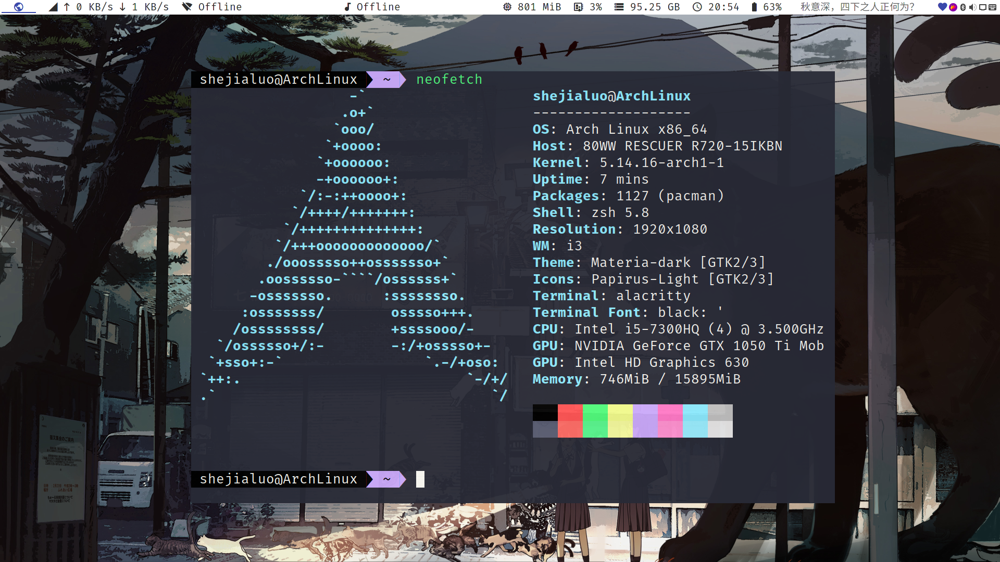
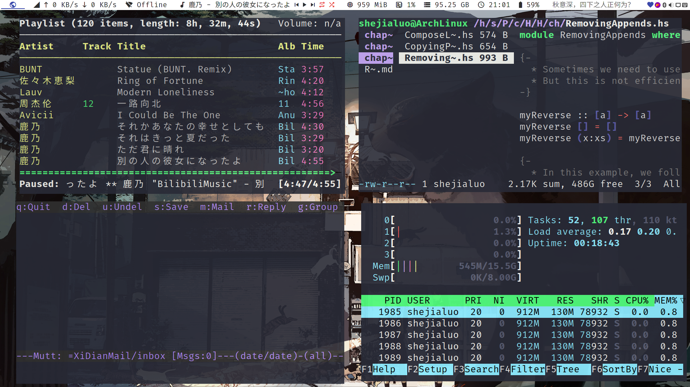

# My OS-configuration

This is my all OS configuration:

+ ArchLinux (use `hyprland`)
+ Windows
+ Android
+ Ios
+ Macos (dual-boot, with asahi-linux)

You could see the [dotfiles](https://github.com/shejialuo/dotfiles) for more reference.

## ArchLinux

